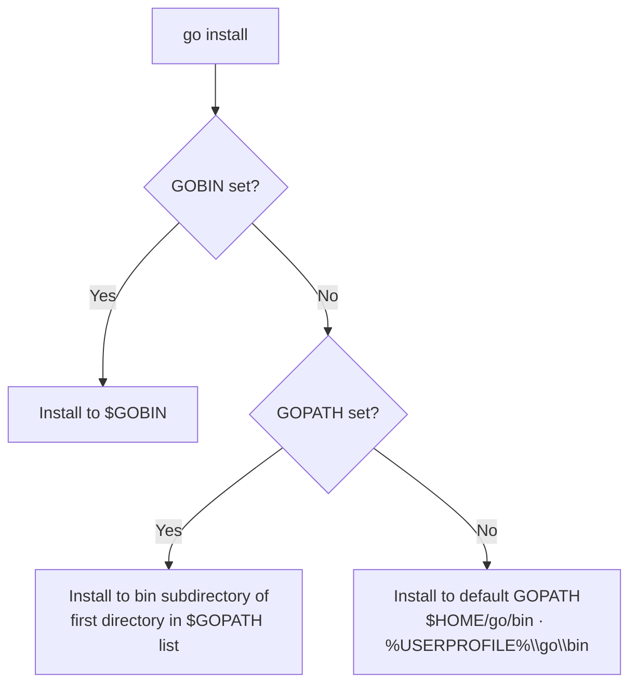

# Environment variables

Go uses environment variables to control the behavior of its toolchain. Two key variables, `GOBIN` and `GOPATH`, determine where `go install` places compiled binaries.

## Install directory resolution

## Variables

| Variable | Description |
|----------|-------------|
| `GOBIN` | Directory where `go install` places compiled binaries. Takes precedence over `GOPATH`. |
| `GOPATH` | Workspace root. Binaries are installed to the `bin` subdirectory of its first listed directory. Defaults to `$HOME/go` on Unix or `%USERPROFILE%\go` on Windows. |